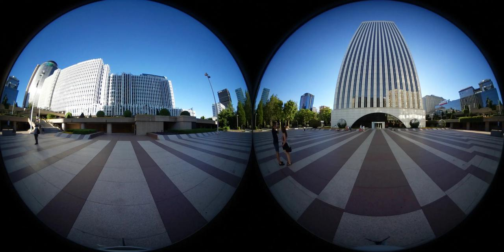
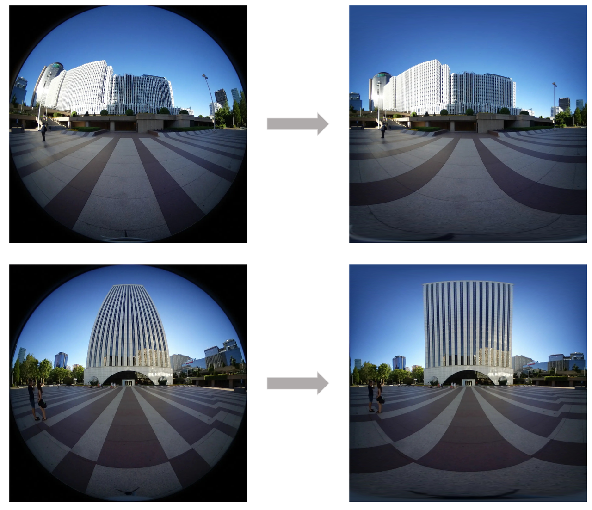
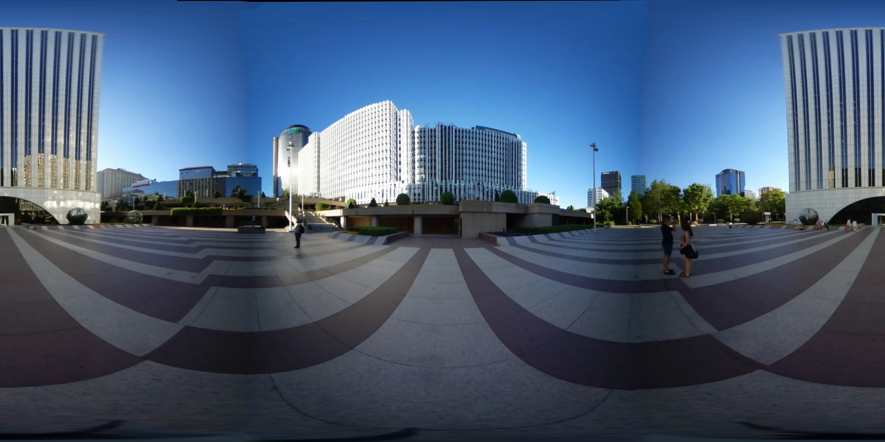

> [中文介绍](README_cn.md)  

## 1. Introduction

VR is a popular imaging technology , where each frame captures a 360-degree perspective. But how is such imagery captured in the industrial sector? Currently, the blogger understands two main approaches:

- A. Using multiple standard cameras, with each camera capturing images at fixed angles, followed by stitching them together.
- B. Using two wide-angle cameras with a field of view (FOV) greater than 180 degrees, and then stitching them together.
We will explicitly define the task with input and output:
Input: Given two images captured from fisheye lenses.
Output: A stitched rectangular-mapped panoramic image (later, you can use this panoramic image for various creative edits)



## 2. Our Method
   
### 2.1 Algorithm Module Decomposition

I first searched online for existing solutions and found a similar functionality here: https://moonagic.com/dualfisheye-to-equirectangular/. However, the results were not particularly satisfactory. Based on my own experience, I divided the pipeline into three parts:

#### 2.1.1 Fisheye Camera Distortion Correction

**Aims:** To unwrap a fisheye image into a rectangular image, distortion correction or projection transformation is needed. Fisheye images typically use a specialized perspective projection, so they need to be transformed into a regular equidistant or rectilinear projection to obtain a rectangular image. This process usually involves calculating the position of each pixel in the new image and then copying the pixels from the fisheye image to their corresponding positions in the new image.

**Method:** Our approach consists of two steps. The first step involves projecting the 2D image of the fisheye original image onto a 3D spherical surface. In the second step, we employ spherical perspective projection. We start by defining polar coordinates for points on the spherical surface, then calculate the Cartesian coordinates of these points, and finally compute the coordinates of the projected points using the mathematical formula for spherical perspective projection.



#### 2.1.2 Feature Points Detection and Matching

**Aims:** We have converted two fisheye images into two rectangular images, but they are not aligned at the edges. Here, we assume that there is an overlap in the edge regions of the two images, and we need to find the alignment transformation that allows them to perfectly overlap in this overlap area.

**Method:** Our approach still consists of two steps. The first step involves detecting feature points within the overlap region to establish a correspondence between the two images. Feature points are typically locations in the image with unique structures or textures, such as corners, edges, keypoints, etc. In the second step, we use the feature descriptors of these feature points for matching. We support the following three methods:

|   Feature Points Detection |    Matching    |
| :------------------------: | :------------: |
|              ORB           |      NN        |
|             SIFT           |      NN        |
|         SuperPoint         |   SuperGlue    |

#### 2.1.3 Alignment and Stitching

**Aims:**  to combine the two images obtained previously into a seamless and cohesive whole.

**Method:** Our approach still involves two main steps: Image Alignment and Image Stitching. In the first step, Image Alignment, we use the information obtained from feature point matching to obtain a transformation matrix (homography matrix). This transformation can include translations, rotations, scaling, affine transformations, or perspective transformations to align the two images in the same coordinate system. In the second step, in most cases, the images in the overlap region are not perfectly aligned. Directly overlaying the overlap using a threshold would create seams at the stitching point. We employ the strategy of finding the best seam line.This process ensures that the two images are correctly aligned and seamlessly stitched together, resulting in a panoramic image.




### 2.2 Environment Setup

> python3 + numpy + opencv + torch

**INSTALL.sh**

```
init(){
    if [[ `python -V` =~ "Python 3." ]] ;then
        echo "python version: " `python -V`
    else
        echo "python version need >=3.6"
        exit -2
    fi
    pip install -r ./requirements.txt
    pip install torch==1.11.0 torchvision torchaudio --extra-index-url https://download.pytorch.org/whl/cpu
}
init
```

## 3. Source Code
We have sold over 50 copies in various channels, and we can provide a complete pipeline that converts fisheye images into rectangular panoramic images. Each sub module has been fully decoupled. To obtain it, please go to [Gumroad](https://bloodyant.gumroad.com/l/psltn).
